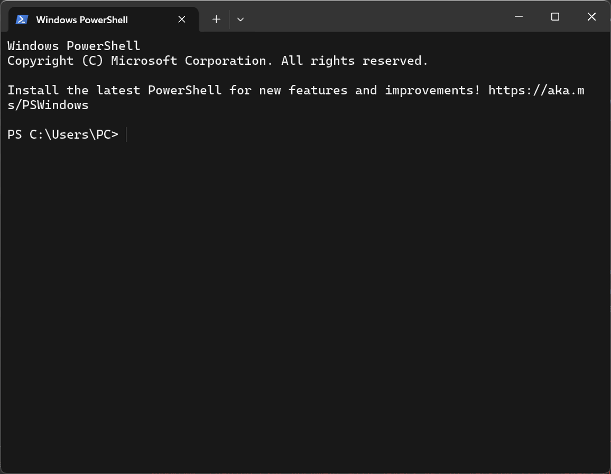
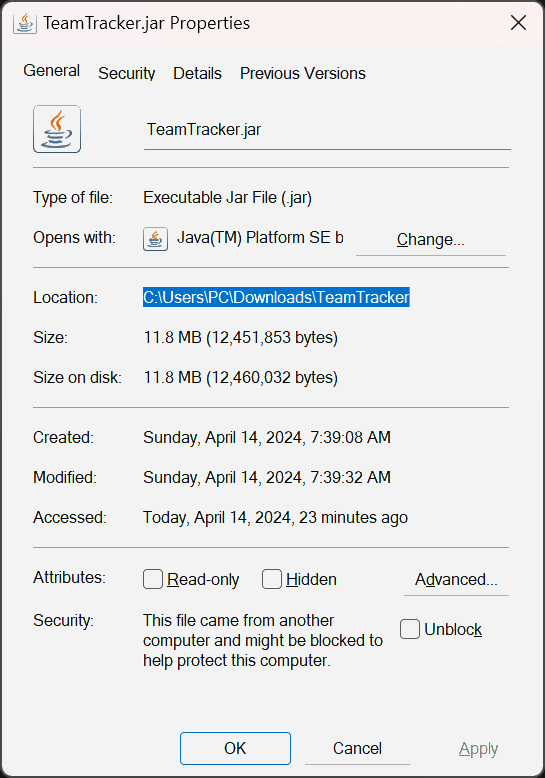

# TeamTracker User Guide

Welcome to TeamTracker, your **ultimate solution for managing contacts and tasks!** 

Designed with **simplicity** in mind, TeamTracker seamlessly **combines** the ease of a **Graphical User Interface 
(GUI)** with the efficiency of a **Command Line Interface (CLI)**, catering to users of all technical abilities.

Don't worry if you're not tech-savvy – TeamTracker is designed for **effortless use**, whether you're a coding geek
or just getting started. Our **intuitive interface** makes task and contact management a breeze, so you can focus on
what matters most without any hassle.

<!-- * Table of Contents -->
<page-nav-print />

--------------------------------------------------------------------------------------------------------------------

## Quick start

1. Ensure you have Java `11` or above installed in your Computer.
Run `java -version` on your command terminal to check your Java version.

2. Download the latest `TeamTracker.jar` from [here](https://github.com/AY2324S2-CS2103T-W13-4/tp/releases).

3. Copy the file to the folder you want to use as the _home folder_ for your TeamTracker.

4. Open a command terminal, `cd` into the folder you put the jar file in, and use the
`java -jar TeamTracker.jar`command to run the application (if you are not sure how to use the command terminal,
refer to [this](#for-user-with-no-experience-with-command-terminal-navigating-the-command-terminal) 
section for a more detailed guide). 
   A GUI similar to the below should appear in a few seconds. Note how the app contains some sample data. 
   

5. Type the command in the command box and press Enter to execute it. e.g. typing **`help`** and pressing 
Enter will open the help window. 

   Some example commands you can try:

   * `listtask` : Lists all tasks.

   * `add n/John Doe p/98765432 e/johnd@example.com a/John street, block 123, #01-01` : Adds a contact 
   named `John Doe` to the Address Book.

   * `deletetask 2` : Deletes the 2nd task shown in the current list.

   * `clear` : Deletes all contacts.

   * `addtask n/Task 1 d/Do homework p/low` : Add a task named `Task 1` with description `Do homework`
   and priority `LOW`.

   * `exit` : Exits the app.

6. Congratulations, you are now a TeamTracker user! Get ready to take control of your tasks and contacts efficiently!
   Refer to the [Features](#features) section below for details of each command.

--------------------------------------------------------------------------------------------------------------------

### (For user with no experience on command terminal) Open and navigate the command terminal

1. Click on the Windows icon on your computer, search "Terminal", then open the first app that popped up.
A UI similar to the below should appear. 
    
2. Go to the folder you put the file `TeamTracker.jar`. Then, right-click on the jar file, select "Properties",
and copy the details in the "Location:" field. Use the picture below for references.
    
3. Go back to the Terminal, type `cd` followed by a whitespace, then paste the Location you just copied. 
Now you should be at the folder where `TeamTracker.jar` is stored.
4. Type `java -jar TeamTracker.jar` to run the application. You might run `java -version` to check the Java version
of your computer before running the jar file. Read the [Quick start](#quick-start) section again to check the Java
version required for our app.
5. Congratulations, you are now a TeamTracker user! Get ready to take control of your tasks and contacts efficiently!
Refer to the [Features](#features) section below for details of each command.

--------------------------------------------------------------------------------------------------------------------

## Features

<box type="info" seamless>

**Notes about the command format:** 

* Words in `UPPER_CASE` are the parameters to be supplied by the user. 
  e.g. in `add n/NAME`, `NAME` is a parameter which can be used as `add n/Shi Kang`.

* Items in square brackets are optional. 
  e.g `n/TASK_NAME [by/DEADLINE]` can be used as `n/Task 1 by/23-12-2024 23:59` or as `n/Task 1`.

* Parameters can be in any order. 
  e.g. if the command specifies `n/NAME p/PHONE_NUMBER`, `p/PHONE_NUMBER n/NAME` is also acceptable.

* Extraneous parameters for commands that do not take in parameters (such 
as `help`, `list`, `exit` and `clear`) will be ignored. 
  e.g. if the command specifies `help 123`, it will be interpreted as `help`.

* If you are using a PDF version of this document, be careful when copying and pasting commands that span 
multiple lines as space characters surrounding line-breaks may be omitted when copied over to the application.
</box>

### Viewing help : `help`

Shows a message explaning how to access the help page.

Format: `help`

### Adding a person: `add`

Adds a person to the address book.

Format: `add n/NAME p/PHONE_NUMBER e/EMAIL a/ADDRESS​`

<box type="tip" seamless>

**Tip:** A person can have any number of tags (including 0)
</box>

Examples:
* `add n/John Doe p/98765432 e/johnd@example.com a/John street, block 123, #01-01`
* `add n/Betsy Crowe t/friend e/betsycrowe@example.com a/Newgate Prison p/1234567`

### Listing all persons : `list`

Shows a list of all persons in the address book.

Format: `list`

### Editing a person : `edit`

Edits an existing person in the address book.

Format: `edit INDEX [n/NAME] [p/PHONE] [e/EMAIL] [a/ADDRESS]`

* Edits the person at the specified `INDEX`. The index refers to the index number shown in the displayed person list. The index **must be a positive integer** 1, 2, 3, …​
* At least one of the optional fields must be provided.
* Existing values will be updated to the input values.

Examples:
*  `edit 1 p/91234567 e/johndoe@example.com` Edits the phone number and email address of the 1st person to be `91234567` and `johndoe@example.com` respectively.
*  `edit 2 n/Betsy Crower` Edits the name of the 2nd person to be `Betsy Crower` and clears all existing tags.

### Locating persons by name: `find`

Finds persons whose names contain any of the given keywords.

Format: `find KEYWORD [MORE_KEYWORDS]`

* The search is case-insensitive. e.g `hans` will match `Hans`
* The order of the keywords does not matter. e.g. `Hans Bo` will match `Bo Hans`
* Only the name is searched.
* Only full words will be matched e.g. `Han` will not match `Hans`
* Persons matching at least one keyword will be returned (i.e. `OR` search).
  e.g. `Hans Bo` will return `Hans Gruber`, `Bo Yang`

Examples:
* `find John` returns `john` and `John Doe`
* `find alex david` returns `Alex Yeoh`, `David Li` 
  

### Deleting a person : `delete`

Deletes the specified person from the address book.

Format: `delete INDEX`

* Deletes the person at the specified `INDEX`.
* The index refers to the index number shown in the displayed person list.
* The index **must be a positive integer** 1, 2, 3, …​

Examples:
* `list` followed by `delete 2` deletes the 2nd person in the address book.
* `find Betsy` followed by `delete 1` deletes the 1st person in the results of the `find` command.

### Clearing all entries : `clear`

Clears all entries from the address book.

Format: `clear`

### Adding a task: `addtask`

* Adds a task to the task list with three levels of priority (LOW, MEDIUM, HIGH).
* Priority can also be in integers (1-Low, 2-Medium, 3-High).
* The deadline is optional for the adding of tasks.

Format: `addtask n/NAME d/DESCRIPTION p/PRIORITY [by/DEADLINE]​`

Examples:
* `addtask n/Task 1 d/Do homework p/HIGH`
* `addtask n/Task 1 d/Do homework p/1`
* `addtask n/Task 1 d/Do homework p/HIGH by/12-12-2024 23:59`

### Assigning a task: `assign`

Assigns a task to a person.

Format: `assign TASK_INDEX to/PERSON_INDEX`

Examples:
* `assign 1 to/1`

### Unassigning a task: `unassign`

Unassigns a task to a person.

Format: `unassign TASK_INDEX to/PERSON_INDEX`

Examples:
* `unassign 1 to/1`

### Clearing the tasks of a person: `cleartask`

Clears the tasks of a person.

Format: `cleartask PERSON_INDEX`

Examples
* `cleartask 1`

### Marking a task: `marktask`

Marks a task to the task list as done.

Format: `marktask TASK_INDEX`

Examples:
* `marktask 1`

### Unmarking a task: `unmarktask`

Marks a task to the task list as not done.

Format: `unmarktask TASK_INDEX`

Examples:
* `unmarktask 1`

### Deleting a task: `deletetask`

Deletes the specified task from the task list.

Format: `deletetask TASK_INDEX`

* Deletes the task at the specified `TASK_INDEX`.
* The index refers to the index number shown in the displayed task list.
* The index **must be a positive integer** 1, 2, 3, …​

Examples:
* `listtask` followed by `deletetask 1` deletes the 1st task in the task list.
* `findtask today` followed by `deletetask 2` deletes the 2nd task in the results of the `findtask` command.

### Editing a task: `edittask`

Edits an existing task in the task listx.

Format: `edittask TASK_INDEX [n/TASK_NAME] [d/TASK_DESCRIPTION] [p/TASK_PRIORITY] [by/TASK_DEADLINE]​`

* Edits the task at the specified `TASK_INDEX`. The index refers to the index number shown in the displayed task list. The index **must be a positive integer** 1, 2, 3, …​
* At least one of the optional fields must be provided.
* Existing values will be updated to the input values.

Examples:
* `edittask 1 p/high`
* `edittask 2 d/new description by/04-04-2024 10:33`
* `edittask 3 n/new task d/new description p/low by/04-04-2024 10:33`

### Listing the tasks: `listtask`

Shows a list of all tasks in the task list.

Format: `listtask`

Examples:
* `listtask`

### Finding a task or tasks by task name: `findtask`
Finds tasks which names contain any of the given keywords.

Format `findtask KEYWORD [MORE_KEYWORDS]`

* The search is case-insensitive. e.g `2103t` will match `2103T`
* The order of the keywords does not matter. e.g. `findpriority implement` will match `implement findpriority`
* Only the task name is searched.
* Only full words will be matched e.g. `prio` will not match `priority`
* Tasks matching at least one keyword will be returned (i.e. `OR` search).
  e.g. `2103t 2101` will return `2101 CA3`, `2103t milestone`

Examples:
* `findtask implement` returns `implement findpriority` and `implement mass ops`
* `findtask cs2103t cs2101` returns `CS2101 CA3`, `CS2103T developer guide`

### Exiting the program : `exit`

Exits the program.

Format: `exit`

### Saving the data

AddressBook and TaskList data are saved in the hard disk automatically after any command that changes the data. There is no need to save manually.

### Editing the data file

AddressBook data are saved automatically as a JSON file `[JAR file location]/data/addressbook.json`. Advanced users are welcome to update data directly by editing that data file.
TaskList data are saved automatically as a JSON file `[JAR file location]/data/tasklist.json`. Advanced users are welcome to update data directly by editing that data file.

<box type="warning" seamless>

**Caution:**
If your changes to the data file makes its format invalid, TeamTracker will discard all data and start with an empty data file at the next run.  Hence, it is recommended to take a backup of the file before editing it. 
Furthermore, certain edits can cause the TeamTracker to behave in unexpected ways (e.g., if a value entered is outside the acceptable range). Therefore, edit the data file only if you are confident that you can update it correctly.
</box>

### Archiving data files `[coming in v2.0]`

_Details coming soon ..._

--------------------------------------------------------------------------------------------------------------------

## FAQ

**Q**: How do I transfer my data to another Computer? 
**A**: Install the app in the other computer and overwrite the empty data file it creates with the file that contains the data of your previous TeamTracker home folder.

--------------------------------------------------------------------------------------------------------------------

## Known issues

1. **When using multiple screens**, if you move the application to a secondary screen, and later switch to using only the primary screen, the GUI will open off-screen. The remedy is to delete the `preferences.json` file created by the application before running the application again.

--------------------------------------------------------------------------------------------------------------------

## Command summary

Action     | Format, Examples
-----------|----------------------------------------------------------------------------------------------------------------------------------------------------------------------
**Add**    | `add n/NAME p/PHONE_NUMBER e/EMAIL a/ADDRESS [t/TAG]…​`   e.g., `add n/James Ho p/22224444 e/jamesho@example.com a/123, Clementi Rd, 1234665 t/friend t/colleague`
**Clear**  | `clear`
**Delete** | `delete INDEX`  e.g., `delete 3`
**Edit**   | `edit INDEX [n/NAME] [p/PHONE_NUMBER] [e/EMAIL] [a/ADDRESS] [t/TAG]…​`  e.g.,`edit 2 n/James Lee e/jameslee@example.com`
**Find**   | `find KEYWORD [MORE_KEYWORDS]`  e.g., `find James Jake`
**List**   | `list`
**Help**   | `help`
**Add Task**   | `addtask n/NAME d/DESCRIPTION p/PRIORITY [by/DEADLINE]`
**Delete Task**   | `deletetask TASK_INDEX`
**Edit Task**   | `edittask TASK_INDEX [n/TASK_NAME] [d/TASK_DESCRIPTION] [p/TASK_PRIORITY] [by/TASK_DEADLINE]​`
**Assign Task**   | `assign TASK_INDEX to/PERSON_INDEX​`
**Mark Task**   | `marktask TASK_INDEX​`
**Unmark Task**   | `unmarktask TASK_INDEX​`
**Find Task**     | `findtask KEYWORD [MORE_KEYWORDS]`   e.g., `findtask 2101 2103t`
**List Task**   | `listtask​`
